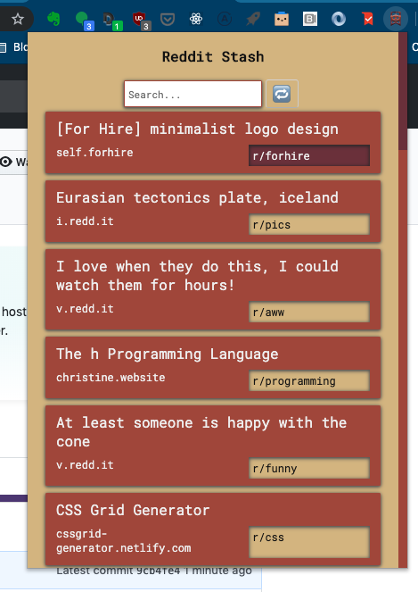

# redditStash
Chrome Extension that shows saved reddit bookmarks

[Chrome Store Link](https://chrome.google.com/webstore/detail/reddit-stash/inhipkcfbhpbdeciibgjjghbnijhfjfo)

## About
Reddit Stash is a Chrome Extension that shows 'Saved Posts' from your reddit account. It requires you to be logged into reddit to work, but besides that requires no configuration.

## Tech Stack
No dependencies, but it does use Web Components & regular old CSS for styling.

## New Features in 0.2
- Crawls Entire Saved Link history for logged in user and saves results locally.
- Searchable by title, subreddit, author, domain, and self-text. 
- Better list styling.
- Refresh button

Icons used:
Material Bookmark Icon: https://material.io/tools/icons/?search=bookm&icon=bookmark_border&style=round
Reddit Alien Font Awesome Icon: https://fontawesome.com/icons/reddit-alien?style=brands
